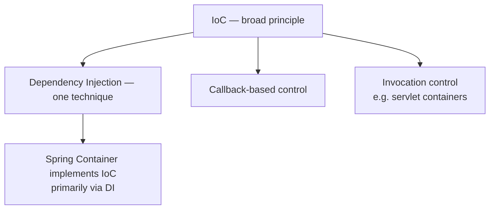

# IoC & Dependency Injection

> Status: 🚧 Work in progress — this file grows as the mentorship series progresses.
> Currently covers: Sections 1–5 (Core conceptual foundation, pre-Spring).

---

## 1. What Problem Are We Solving?

Start with plain Java, no Spring, no interfaces:

```java
class PaymentService {
    public void pay(double amount) {
        System.out.println("Paying ₹" + amount);
    }
}

class OrderService {
    private PaymentService paymentService = new PaymentService(); // 🚩

    public void placeOrder(double amount) {
        paymentService.pay(amount);
    }
}
```

This compiles and runs fine — but `OrderService` has silently taken on a responsibility
that isn't its job: **deciding how to construct its own dependencies.**

Its actual job is *placing orders*. Building a `PaymentService` correctly (API keys,
timeouts, retries, which gateway) is a completely different concern. When these two
concerns live in the same line of code, every future change to *how PaymentService is
built* forces a change inside `OrderService` — a class that has nothing to do with
payment gateway configuration.

---

## 2. Tight Coupling

**Tight coupling** = a class depends directly on another class's *concrete
implementation*, and additionally is responsible for *creating* that dependency itself.

This is actually two separable problems:

| Flavor of coupling | Symptom | Fixed by |
|---|---|---|
| Coupling to a **concrete class** | Can't swap `PaymentService` for `StripePaymentService` without editing `OrderService` | Programming to an interface (Section 6 onward) |
| Coupling via **self-construction** | `OrderService` contains `new PaymentService()` | Dependency Injection (this section) |

### Concrete costs of tight coupling

- **Ripple-effect changes** — if `PaymentService`'s constructor needs new parameters,
  every class that does `new PaymentService(...)` must change too.
- **Untestable in isolation** — there is no seam to substitute a fake/mock
  `PaymentService`; testing `OrderService` forces you to also execute real
  `PaymentService` logic.
- **No shared lifecycle control** — `OrderService` decides *when* a `PaymentService` is
  created and holds the only reference; you can't easily enforce "one shared instance
  across the app."

---

## 3. Inversion of Control

**IoC is a design *principle*, not a specific technique.**

> Control over some aspect of a program's flow is handed to an external entity, instead
> of the program controlling that aspect itself.

IoC is broader than dependency creation — it shows up in several forms:

- **Object creation/wiring control** → *this is what DI addresses.*
- **Invocation control** → e.g. a servlet container calls your `doGet()`; you never
  write the request loop yourself.
- **Callback control** → e.g. a GUI framework calls `onClick()` when *it* decides to.
- **Template method pattern** → base class controls the algorithm skeleton; your code
  only fills in steps.

The common thread: in naive code, *your code* is in control — it calls, creates,
sequences things. Under IoC, an external framework/container takes that control, and
your code becomes something that gets *called* or *supplied*, rather than something
that calls or supplies itself. That's the "inversion."

---

## 4. Dependency Injection

**DI is one specific technique for achieving IoC** — applied specifically to the
problem of supplying an object's dependencies.

> An object's dependencies are provided ("injected") from an external source, instead
> of the object constructing them itself.

Transforming Section 1's example:

```java
class OrderService {
    private final PaymentService paymentService;

    public OrderService(PaymentService paymentService) { // dependency handed in
        this.paymentService = paymentService;
    }

    public void placeOrder(double amount) {
        paymentService.pay(amount);
    }
}
```

```java
// external wiring code — nobody inside OrderService does "new PaymentService()" anymore
PaymentService paymentService = new PaymentService();
OrderService orderService = new OrderService(paymentService);
orderService.placeOrder(500.0);
```

### ⚠️ The most important, most-forgotten point in this entire topic

> **DI never removes a dependency. `OrderService` still cannot function without a
> `PaymentService` — call `placeOrder()` without providing one and it NPEs immediately.
> DI only changes *who is responsible for creating and supplying* the dependency.**

| | Before DI | After DI |
|---|---|---|
| Does `OrderService` need a `PaymentService` to function? | Yes | **Still yes** |
| Who constructs the `PaymentService`? | `OrderService` itself | External code |
| Does `OrderService`'s source contain `new PaymentService(...)`? | Yes | No |

The 3-line wiring block above is, conceptually, a **hand-rolled IoC container** — doing
manually, for two objects, what Spring's `ApplicationContext` will later do
automatically for hundreds.

---

## 5. IoC vs DI

| Concept | What it is | Scope | Relationship |
|---|---|---|---|
| **IoC** | A design *principle* | Broad — object creation, invocation control, callbacks, framework control | The umbrella concept |
| **DI** | A *technique* implementing IoC | Narrow — specifically how an object receives its dependencies | One way (not the only way) to achieve IoC |
| **Spring Container** | A concrete *implementation* | Software (`ApplicationContext`) | Uses DI (and other mechanisms) to realize IoC in practice |

**Interview-ready sentence:**
> "IoC is the general principle that control is inverted and handed to an external
> party. DI is the specific technique of achieving IoC by supplying an object's
> dependencies from outside rather than having it construct them itself. Not all IoC is
> DI — but the DI Spring performs is a form of IoC."

**Correction to a common oversimplification:** "IoC and DI are the same thing" is a
loose approximation that happens to *feel* true inside Spring, because DI is Spring's
most visible application of IoC. It is not technically accurate in general — IoC is the
broader principle; DI is one technique among several (see Section 3's callback/
invocation-control examples, which are IoC but not DI).



---

## Key Takeaways So Far

- Tight coupling has two independent causes: concrete-class coupling, and
  self-construction coupling.
- IoC = principle. DI = technique. Container = implementation.
- **DI relocates responsibility for creation — it never eliminates the dependency
  itself.**
- IoC is broader than DI; conflating them is a common but avoidable interview mistake.

*(Next up: Section 6 — Types of DI: Constructor, Setter, Field injection, and manual
Java implementation without Spring.)*
